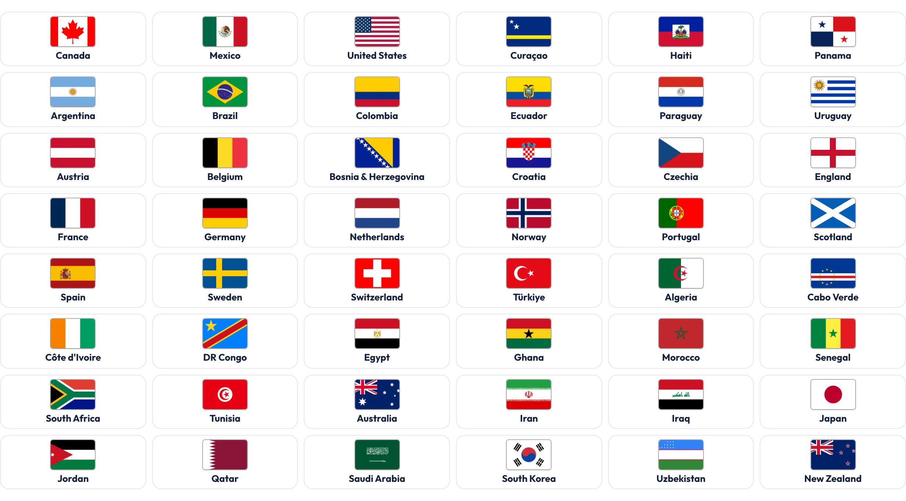
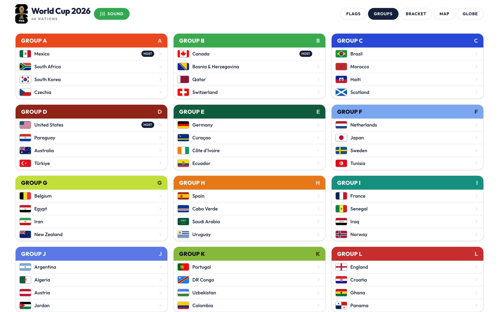
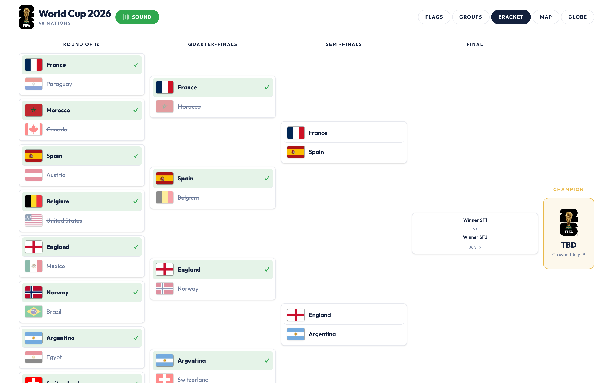
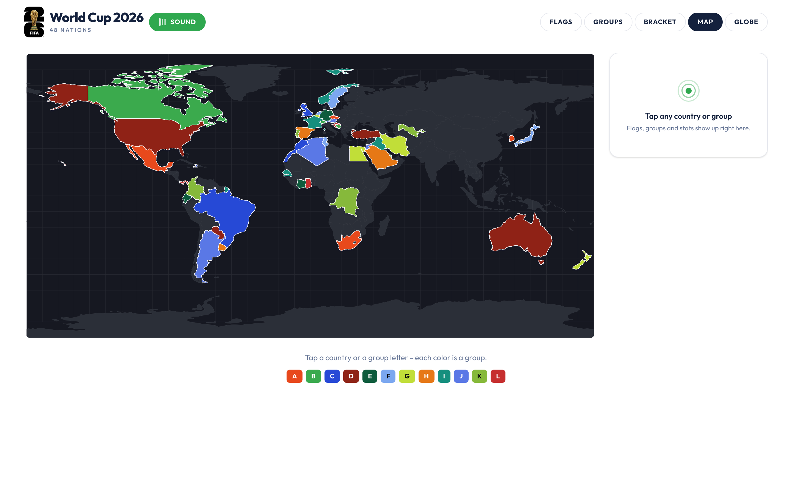
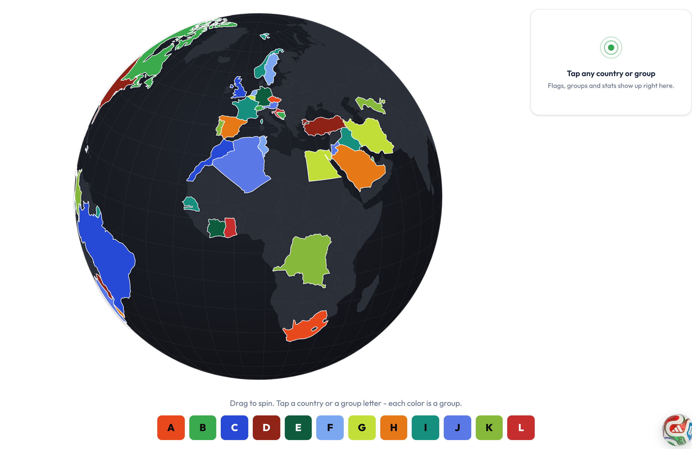
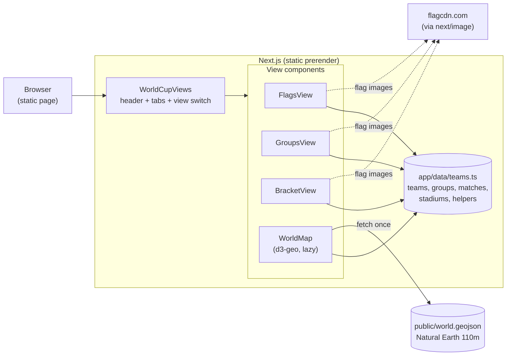

# World Cup 2026

An interactive companion for the 2026 FIFA World Cup: all 48 qualified nations in five linked views - a flag wall, color-coded groups, a live knockout bracket, and the same draw painted onto an interactive 2D world map and a draggable 3D globe. Tap any country for its stats and full match history.



[](LICENSE)


## Contents

- [Features](#features)
- [Architecture](#architecture)
- [Design decisions and trade-offs](#design-decisions-and-trade-offs)
- [Tech stack](#tech-stack)
- [Quick start](#quick-start)
- [Configuration](#configuration)
- [Testing](#testing)
- [Project layout](#project-layout)
- [License](#license)

## Features

- All 48 qualified nations with real flags, grouped by confederation with the three hosts first.
- Five linked views - Flags, Groups, Bracket, Map, and Globe - switched instantly from the header, no page loads.
- Color-coded groups: 12 groups in FIFA brand colors, with a Host badge on Canada, Mexico, and the USA.
- Live knockout bracket - real results through the semi-finals, losers struck through, the final and champion still TBD.
- One d3-geo view renders both an equirectangular 2D map and a draggable 3D globe from a single 244KB geojson.
- Tap a country or a group letter to highlight it with a glow and open the side panel; drag to spin the globe.
- Country detail modal: flag, group, confederation, capital, continent, population, area, currency, and every match with its real score (W / L / D).
- Host nations open their full stadium list (16 venues) inside the same modal.
- A physics-driven floating ball on every page: drag to grab, flick to throw, and it ricochets off the window edges with real velocity-based bounces (see below).
- Official theme audio, loaded lazily and toggled from the header - nothing downloads until you press play.
- Fully responsive from phone to desktop with no horizontal scroll; real FIFA 26 emblem as favicon and iOS icon.

### The floating ball

A World Cup ball floats above every page (`FloatingBall.tsx`) with a small physics engine:

- **Flick to throw** - the release velocity is measured from your last ~90ms of drag, so a hard flick flies far and bounces many times, a gentle one barely moves.
- **Real bounces** - it reflects off all four window edges keeping 72% of its energy each hit, with a rolling spin, then settles and idles (the animation loop sleeps at rest to save battery).
- **Shake to ignite** - wiggle it left/right fast: 3+ reversals leave a black-and-grey smoke trail, 6+ set it on fire and the next throw launches at 5x speed, with a canvas particle trail.
- It stays above modals but never covers the header, and the smoke/fire canvas is `pointer-events: none` so it never blocks a tap.

The bug-prone math (release velocity, wall bounce, shake detection) is isolated in `ballPhysics.ts` and unit-tested.

### The five views

| Groups | Bracket |
|--------|---------|
|  |  |
| **Map** | **Globe** |
|  |  |

## Architecture

World Cup 2026 is a fully static Next.js app - no backend, no database, no API routes. One server shell mounts a lean client app-shell that switches between view components, and every view reads from a single typed data module. The map and globe are one lazy-loaded d3-geo component that draws two projections from one Natural Earth geojson.



One data module, one direction of flow:

| Layer | Files | Role |
|-------|-------|------|
| Shell | `app/page.tsx`, `app/components/WorldCupViews.tsx` | Static server page mounts the client app-shell (header, tabs, view switch) |
| Views | `app/components/views/*`, `app/components/WorldMap.tsx` | Flags, Groups, Bracket (pure) + the lazy d3-geo Map/Globe |
| Data | `app/data/teams.ts` | Single source: 48 teams, 12 groups, 102 matches, 16 stadiums, country stats + lookups (`TEAM_BY_NAME`, `matchesFor`) |
| Leaf | `Flag`, `Logo`, `ThemeSong`, `CountryCard` | Small presentational pieces reused across views |
| Overlay | `FloatingBall.tsx` + `ballPhysics.ts` | Physics ball + canvas smoke/fire, mounted once in the root layout; pure math split out and tested |
| Assets | `public/world.geojson`, `public/theme.mp3` | Slimmed Natural Earth geometry + the theme clip |

`WorldMap` is loaded with `next/dynamic` (`ssr: false`), so d3-geo and the geojson stay out of the initial bundle until you open the Map or Globe tab. The same component swaps between `geoEquirectangular` (flat map) and `geoOrthographic` (globe) on a single prop.

## Design decisions and trade-offs

The whole app optimizes for one thing: a fast, offline-friendly, zero-backend tournament board a kid can explore. Every choice below follows from that.

| Decision | Chosen | Alternative | Why this trade-off | Cost we accept |
|----------|--------|-------------|--------------------|----------------|
| Data source | Static TypeScript module | CMS / database / live API | Zero backend, instant static prerender, versioned in git and unit-tested | Match results are updated by editing code after games are played |
| Rendering | Fully static (no SSR, no API) | Server components with data fetch | Deploys to any static or edge host, instant TTFB, nothing to run | No personalization or live-updating scores |
| Map + globe | One d3-geo component, two projections | Mapbox / Leaflet / vector tiles | No API key, no tile server; one 244KB geojson drives both 2D and 3D | Hand-rolled interaction, no deep zoom or pan |
| Flags | flagcdn via `next/image` | Bundle 48 SVGs in the repo | Crisp at any size, optimized and cached by the image pipeline, tiny repo | A runtime dependency on a third-party host |
| Theme audio | Native `<audio>`, `preload="none"` | Autoplay / eager preload | ~2MB is fetched only on a user gesture; the page stays light | Manual play; the clip is the heaviest asset |
| View state | Local `useState` switch | A route segment per view | One-page instant switching, no navigation cost | Views are not individually deep-linkable |

## Tech stack

- Next.js 16 (App Router, Turbopack, static prerender)
- React 19, TypeScript in strict mode
- Tailwind CSS v4
- d3-geo - `geoOrthographic` globe + `geoEquirectangular` map, over Natural Earth 110m geometry
- flag images from [flagcdn.com](https://flagcdn.com) through `next/image`
- node:test data-integrity tests, ESLint 9 flat config, GitHub Actions CI
- Hosted on Vercel

## Quick start

```bash
git clone https://github.com/bunlongheng/worldcup26.git
cd worldcup26
npm install
npm run dev
```

Open http://localhost:3009. The build is static, so `npm run build && npm start` serves the same thing with no runtime dependencies.

## Configuration

No environment variables required.

## Testing

```bash
npm test        # node:test data-integrity assertions over app/data/teams.ts
npm run lint    # ESLint 9 flat config
npm run typecheck
```

The tests lock the core invariants - 48 unique teams, 12 groups of 4, 3 hosts, 16 stadiums, and every match referencing a real team. The same three checks plus `npm run build` run on every push in GitHub Actions.

## Project layout

```
app/
  page.tsx                 static server shell
  layout.tsx               metadata, fonts, icons
  globals.css              Tailwind v4 theme tokens
  data/
    teams.ts               48 teams, groups, matches, stadiums, stats + helpers
  components/
    WorldCupViews.tsx      app shell: header, tabs, view switch
    WorldMap.tsx           d3-geo 2D map + 3D globe (lazy, client)
    FloatingBall.tsx       physics ball + canvas smoke/fire (above all pages)
    ballPhysics.ts         pure, tested ball math (velocity, bounce, shake)
    Flag.tsx               next/image flag
    Logo.tsx               FIFA 26 emblem
    ThemeSong.tsx          lazy theme-audio toggle
    CountryCard.tsx        country detail card
    views/
      FlagsView.tsx        48-flag grid + country modal
      GroupsView.tsx       12 groups + match center + stadium list
      BracketView.tsx      knockout bracket
public/
  world.geojson            Natural Earth 110m geometry (244KB)
  theme.mp3                official theme clip
  ball.png                 the floating World Cup ball sprite
  wc26-logo.png            emblem
tests/
  data.test.ts             data-integrity assertions
  ballPhysics.test.ts      ball physics assertions
.github/workflows/ci.yml   typecheck, lint, test, build
```

## License

[MIT](LICENSE) (c) 2026 Bunlong Heng
